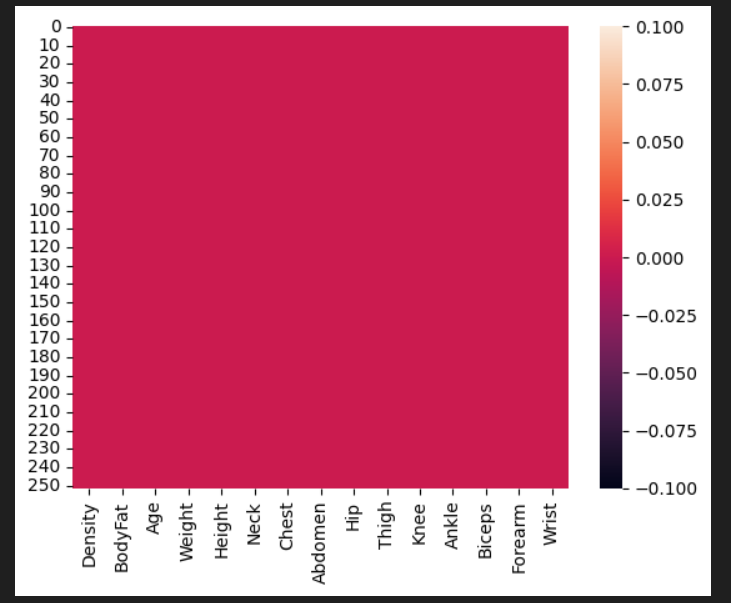
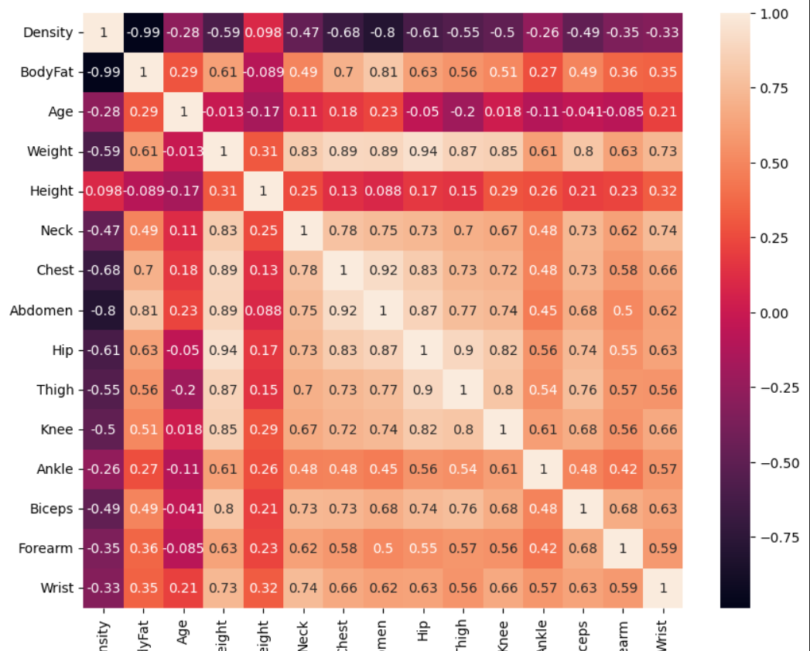
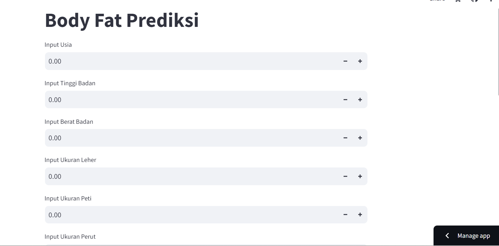

# Laporan Proyek Machine Learning

### Nama : Ikhsan Al Fajar

### Nim : 211351062

### Kelas : Pagi B

## Domain Proyek

Data ini berisi mengenai indeks difusi pada negara Jepang yang merupakan prpyek yang berkaitan dengan ekonomi dan analisis data. Adapun beberapa indicator yang dipertimbangkan ialah tren rumah tangga, trend perusahaan, dan tren pekerjaan.sehingga data ini dapat digunakan untuk mengetahui tren ekonomi yang sedang berlangsung dan bisa menjadi indikasi dari seberapa maju atau kestabilan ekonomi pada negara Jepang.

## Business Understanding

Dapat digunakan oleh pemerintah maupun pengamat guna merencanakan suatu gagasan yang dapan menjaga kestabilan ekomoni negara dengan melihat dan mempertimbangkan data tren ekonomi yang diambil dari berbagai aspek yang telah dilakukan pada sebagian besar warga Jepang.

Bagian laporan ini mencakup:

### Problem Statements

Menjelaskan pernyataan masalah latar belakang:

- Kesulitan pemerintah dan petinggi ngeara dalam menjaga kestabilan ekonomi di suatu negara dikarenakan kurangnya pendataan mengenai perilaku konsumsi warga negaranya.

### Goals

Menjelaskan tujuan dari pernyataan masalah:

- Maka dari itu riset yang telah dilakukan dan hasil dari riset ini dapat membantu pemerintah maupun pihak lainnya dalam memberikan informasi mengenai perilaku konsumsi warga negara nya, karna data mengenai tren ekonomi ini dapat menjadi indikasi dari seberapa maju negaranya apabila dilihat dari segi ekonominya.

Semua poin di atas harus diuraikan dengan jelas. Anda bebas menuliskan berapa pernyataan masalah dan juga goals yang diinginkan.

### Solution statements

- Mengadakan pendataan maupun riset secara berkala dan rutin kepada warga negara mengenai tren ekonomi yang berlangsung agar data selalu ter update
- Menjaga perilaku konsumsi warga negara agar kestabilan negara dapat terjaga dengan upaya memberikan sosialisasi mengenai gaya hidup yang sesuai kebutuhan dan tidak melakukan gaya hidup yang konsumtif
- Model yang dihasillkan dari datasets ini menggunakan metode Linear Regression.

## Data Understanding

Kumpulan data ini dapat digunakan untuk menggambarkan teknik regresi berganda. Pengukuran lemak tubuh yang akurat tidaklah mudah/mahal dan diinginkan adanya metode yang mudah untuk memperkirakan lemak tubuh yang tidak merepotkan/mahal.

[Body Fat Prediction Dataset](https://www.kaggle.com/datasets/fedesoriano/body-fat-prediction-dataset).

Selanjutnya menguraikan seluruh variabel atau fitur pada data

### Variabel-variabel pada Global Video Game Sales adalah sebagai berikut:

- Density : menunjukan Kepadatan (float64)
- BodyFat : menunjukan Lemak Tubuh (float64)
- Age : menunjukan Usia (int64)
- Weight : menunjukan Tinggi Badan (float64)
- Height : menunjukan Berat Badan (float64)
- Neck : menunjukan Leher (float64)
- Chest : menunjukan Peti (float64)
- Abdomen : menunjukan Perut (float64)
- Hip : menunjukan Panggul (float64)
- Thigh : menunjukan Paha (float64)
- Knee : menunjukan Lutut (float64)
- Ankle : menunjukan Pergelangan Kaki (float64)
- Biceps : menunjukan Bisep (float64)
- Forearm : menunjukan Lengan Bawah (float64)
- wrist : menunjukan Pergelangan Tangan (float64)

## Data Preparation

### Data Collection

Untuk data collection ini, saya mendapatkan dataset yang nantinya digunakan dari website kaggle dengan nama dataset Body Fat Prediction Dataset

### Data Discovery And Profiling

Untuk bagian ini, kita akan menggunakan teknik EDA. <br>
Pertama kita mengimport semua library yang dibutuhkan,

```bash
import pandas as pd
import numpy as np
import matplotlib.pypot as plt
import seaborn as sns
```

Karena kita menggunakan google colab untuk mengerjakannya maka kita akan import files juga,

```bash
from google.colab import files
```

Lalu mengupload token kaggle agar nanti bisa mendownload sebuah dataset dari kaggle melalui google colab

```bash
file.upload()
```

Setelah mengupload filenya, maka kita akan lanjut dengan membuat sebuah folder untuk menyimpan file kaggle.json yang sudah diupload tadi

```bash
!mkdir -p ~/.kaggle
!cp kaggle.json ~/.kaggle/
!chmod 600 ~/.kaggle/kaggle.json
!ls ~/.kaggle
```

lalu mari kita download datasetsnya

```bash
!kaggle datasets download -d azadshahvaladov/body-fat-prediction-dataset
```

Selanjutnya kita harus extract file yang tadi telah didownload

```bash
!mkdir body-fat-prediction-dataset
!unzip body-fat-prediction-dataset.zip -d body-fat-prediction-dataset
!ls body-fat-prediction-dataset
```

Mari lanjut dengan memasukkan file csv yang telah diextract pada sebuah variable, dan melihat 5 data paling atas dari datasetsnya

```bash
df = pd.read_csv('body-fat-prediction-dataset/bodyfat.csv')
df.head()
```

Untuk melihat mengenai type data dari masing masing kolom kita bisa menggunakan property info,

```bash
df.info()
```

Selanjutnya kita akan memeriksa apakah datasetsnya terdapat baris yang kosong atau null dengan menggunakan seaborn,

```bash
sns.heatmap(df.isnull())
```

 <br>

Mari kita lanjut dengan data exploration kita,

```bash
plt.figure(figsize=(10,8))
sns.heatmap(df.corr(), annot=True)
```



## Modeling

sebelumnya mari kita import library yang nanti akan digunakan,

```bash
from sklearn.model_selection import train_test_split
from sklearn.linear_model import LinearRegression
```

Langkah pertama adalah memasukkan kolom-kolom fitur yang ada di datasets dan juga kolom targetnya,

```bash
features = ['Density','Age','Weight','Height','Neck','Chest','Abdomen','Hip','Thigh','Knee','Ankle','Biceps','Forearm','Wrist']
x = df[features]
y = df['BodyFat']
x.shape, y.shape
```

Selanjutnya kita akan menentukan berapa persen dari datasets yang akan digunakan untuk test dan untuk train

```bash
x_train, X_test, y_train, y_test = train_test_split(x,y,random_state=70)
y_test.shape
```

lalu membuat mode dan memasukkan X_train dan y_train pada model dan memasukkan value predict pada y_pred,

```bash
lr = LinearRegression()
lr.fit(x_train,y_train)
pred = lr.predict(X_test)
```

sekarang kita bisa melihat score dari model kita,

```bash
score = lr.score(X_test, y_test)
print('akurasi model regresi linier = ', score)
```

Bagus juga, 0.9909700768437055, mari kita test menggunakan sebuah array value

```bash
input_data = np.array([[1.0708,23,154.25,67.75,36.2,93.1,85.2,94.5,59,37.3,21.9,32,27.4,17.1]])

prediction = lr.predict(input_data)
print('Estimasi BodyFat :', prediction)
```

berhasil!!, sekarang modelnya sudah selesai, mari kita export sebagai sav agar nanti bisa kita gunakan pada project web streamlit kita.

```bash
import pickle

filename = 'estimasi_BodyFat.sav'
pickle.dump(lr,open(filename,'wb'))
```

## Evaluation

Disini saya menggunakan R2 score sebagai metrik evaluasi.

R-squared atau R2 pada dasarnya digunakan untuk melihat bagaimana penambahan variabel independen membantu menjelaskan varians variabel dependen. Secara umum R2 dapat memberikan ukuran seberapa baik model dalam menjelaskan variabel dependen (variabel yang dipengaruhi) atau goodness of fit.

R2 secara definisi merupakan rasio dari varians yang dijelaskan oleh variabel independen (penjelas) dibandingkan varians tanpa adanya variabel independen, berikut rumus dari R2.

R2 = SSE/SST = 1 - SSR/SST

Setelah itu saya menerapkannya dalam kode menggunakan fungsi r2_score, seperti berikut :

```bash
from sklearn.metrics import r2_score

r2 = r2_score(y_test, pred)
print('r2 score for perfect model is', r2)
```

dan hasil yang saya dapatkan adalah 0.990970076843705, itu berarti model ini memiliki keseimbangan yang baik antara presisi dan recall.

## Deployment

[My Estimation App](https://app-diffusion-index-in-japan-ikhsan.streamlit.app/).



##
